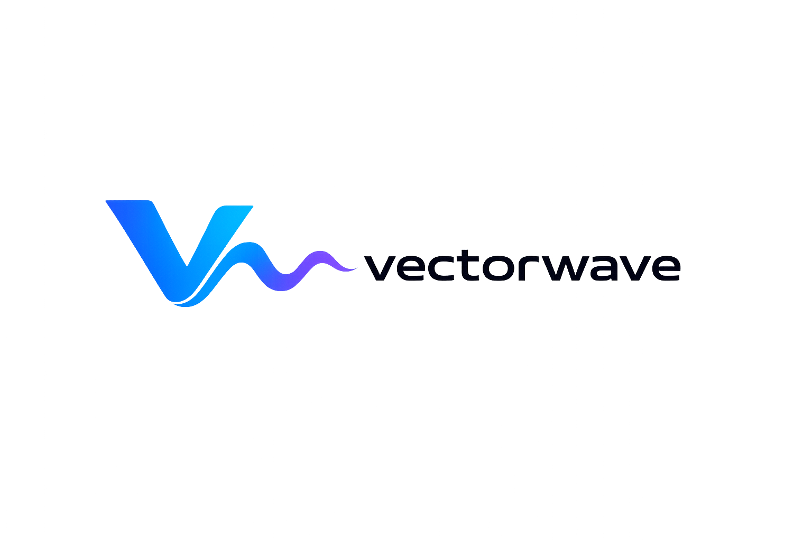
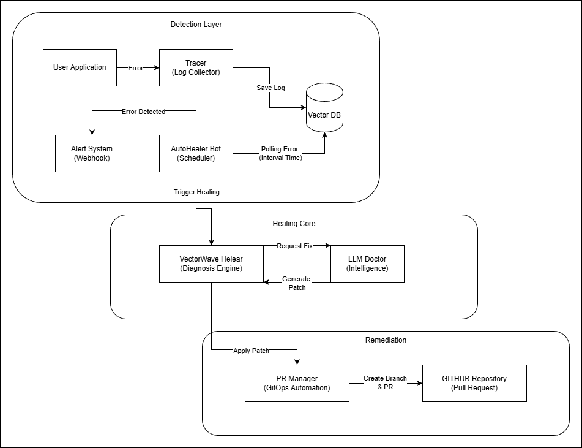
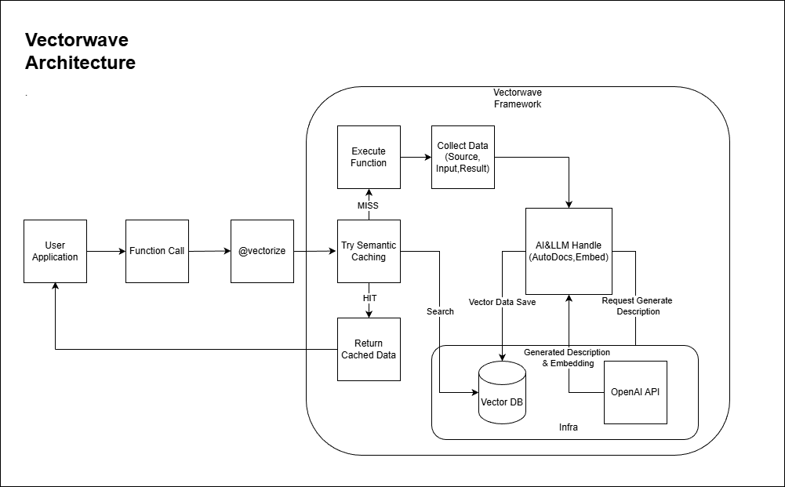
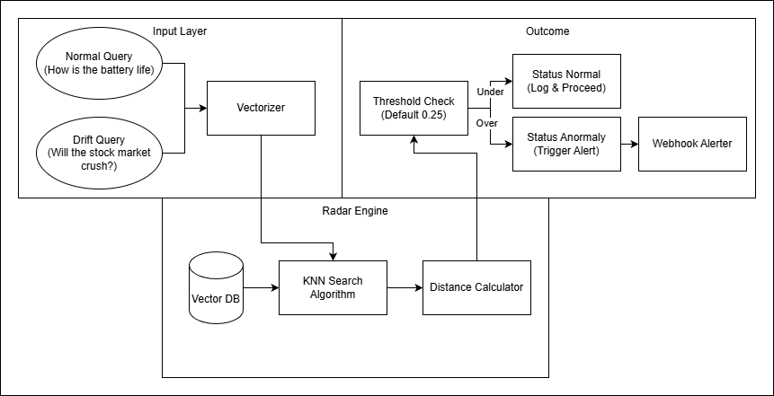
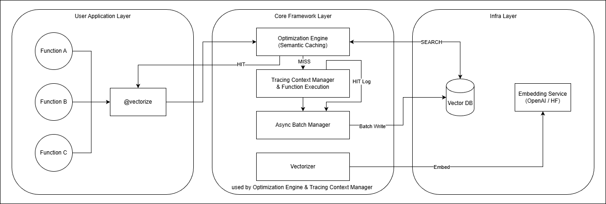

Need more information? Visit [here](https://www.cozymori.net/vectorwave)

# VectorWave


**Make your LLM functions cacheable, testable, and self-healing.**

VectorWave is one decorator that turns any Python function into a vectorized, observable, and replayable unit — and a pytest plugin that turns its golden execution history into a regression test.

```bash
pip install vectorwave             # Pro mode (Weaviate)
pip install "vectorwave[lite]"     # Lite mode (LanceDB, no Docker)
pip install "vectorwave[otel]"     # + OpenTelemetry mirror
```

### Requirements

- **Python**: 3.10 – 3.13
- **Docker** (Pro mode only): runs the Weaviate database. Skip with Lite mode.
- **OpenAI API Key** (optional): for AI auto-documentation and high-performance embeddings.

### How to reach us

- **GitHub Issues**: [https://github.com/cozymori/vectorwave/issues](https://github.com/cozymori/vectorwave/issues)
- **Contributors**: [github.com/Cozymori/VectorWave/graphs/contributors](https://github.com/Cozymori/VectorWave/graphs/contributors)
- **Contributing guide**: [Contributing.md](./Contributing.md)

---

## 🚀 What is VectorWave?

VectorWave solves three problems that LLM-backed Python code keeps running into:

1. **The same prompt is processed twice.** Direct LLM calls are expensive; the same semantic input usually has the same useful output. → **Semantic caching** with cosine-similarity lookup.
2. **You can't `assert a == b` on an LLM.** Output drifts a little every run. A regression that drops a clause looks identical to a regression that swaps a word. → **Pytest plugin** that compares to golden data by similarity, exact match, or LLM judge.
3. **Production errors live in your dashboards, not in your code.** Errors get logged and forgotten. → **Self-healing pipeline** that diagnoses the error from execution history and opens a GitHub PR with a patch.

One decorator (`@vectorize`) gives you all three. Add the pytest marker for free regression tests, the `vectorwave check calibrate` CLI for a sensible threshold, and the OpenTelemetry mirror to plug into your existing observability stack.

---

## 😊 Quick Start

### 1. Install

```bash
pip install vectorwave            # Pro mode (default; requires Weaviate)
# or
pip install "vectorwave[lite]"    # Lite mode — embedded LanceDB, no Docker
```

For Pro mode (Weaviate), bring your own instance or use the bundled dev stack:

```bash
vectorwave dev start              # starts Weaviate + console on localhost
```

For Lite mode, no setup beyond `pip install`:

```bash
export VECTORWAVE_MODE=lite
```

### 2. Three demos in one decorator

#### A. Semantic caching

```python
import time
from vectorwave import vectorize, initialize_database

initialize_database()

@vectorize(semantic_cache=True, cache_threshold=0.95, auto=True)
def expensive_llm_task(query: str):
    time.sleep(2)
    return f"Processed result for: {query}"

# First call: cache miss → 2.0s
print(expensive_llm_task("How do I fix a Python bug?"))

# Second call (semantically similar): cache hit → ~20 ms
print(expensive_llm_task("Tell me how to debug Python code."))
```

#### B. Pytest regression test

After your function has built up some golden executions, drop this in any test file:

```python
import pytest

@pytest.mark.vectorwave(
    target="myapp.expensive_llm_task",
    strategy="similarity",
    threshold=0.85,
    limit=10,
)
def test_no_regression():
    pass
```

`pytest` re-runs the function against captured inputs and fails the test if the new output drifts below the threshold. There is also a `vw_replay` fixture for programmatic inspection. Configuration layers from marker kwargs → `[tool.vectorwave.check."<target>"]` in `pyproject.toml` → global defaults.

To pick a threshold instead of guessing:

```bash
vectorwave check calibrate myapp.expensive_llm_task
# Reports p5/p10/p25/p50/p75/p95 of pairwise similarity and a recommended threshold.
# Use --rerun to measure the honest noise floor by re-executing the function.
```

#### C. Self-healing

```python
@vectorize(auto=True)
def risky_calculation(a, b):
    return a / b

risky_calculation(10, 0)   # ZeroDivisionError
```

VectorWave's `AutoHealerBot` detects the error, retrieves source + stack trace, generates a patch via LLM, and opens a Pull Request in your GitHub repo. No babysitting required.



---

## ⭐ Key Features

### ⚡ Semantic Caching

Cache LLM calls by meaning, not by exact string. Powered by HNSW vector indexes in Weaviate (Pro) or LanceDB (Lite). Threshold-based hit decisions per function.

- **Latency**: seconds → milliseconds.
- **Cost**: up to 90% fewer LLM tokens.



### 🧪 Pytest Regression Testing — *new in 1.0*

One marker, one threshold. Reuses your golden execution history as the test oracle.

```python
@pytest.mark.vectorwave(target="myapp.fn", strategy="similarity", threshold=0.85)
def test_fn_regression():
    pass
```

Three strategies: `exact`, `similarity`, `llm` (LLM-as-a-judge). See [ADR-0002](./docs/adr/0002-pytest-plugin-design.md) for the design rationale.

### 🎯 Threshold Calibration — *new in 1.0*

```bash
vectorwave check calibrate myapp.summarize          # cheap: output diversity
vectorwave check calibrate myapp.summarize --rerun  # honest: noise floor
```

Outputs a percentile distribution + a ready-to-paste `[tool.vectorwave.check."<target>"]` snippet. Recommends `strategy="exact"` for deterministic targets and `strategy="llm"` for highly variable ones.

### 🩺 Self-Healing & GitOps

VectorWave doesn't just log errors — it patches them.

- **Automated Root Cause Analysis** using RAG over your execution history.
- **GitOps Integration**: opens a Pull Request with the fix.
- **Cooldown Mechanism**: prevents PR spam for the same error.

### 💾 Lite Mode — *new in 1.0*

Embedded LanceDB backend. No Docker, no ports, single on-disk directory.

```bash
pip install "vectorwave[lite]"
export VECTORWAVE_MODE=lite
```

Trade-off documented in [ADR-0001](./docs/adr/0001-vectorstore-abstraction.md): Lite mode gives up server-side vectorization and distributed batching in exchange for zero setup.

### 📡 OpenTelemetry Mirror — *new in 1.0*

VW spans appear in your existing OTel stack (Datadog, Honeycomb, Jaeger, Tempo) alongside the rest of your service traces.

```bash
pip install "vectorwave[otel]"
export OTEL_SERVICE_NAME=myapp
```

Mirror, not replacement — VW's own pipeline keeps full semantic context. See [ADR-0003](./docs/adr/0003-opentelemetry-mirror.md).

### 📊 Semantic Drift Radar

Detect when your users start asking things your model wasn't trained for.

- **Anomaly Detection**: distance between new queries and the Golden Dataset.
- **Alerting**: Discord / webhook notifications past the drift threshold (default 0.25).



---

## 🏗 Architecture

VectorWave sits as a transparent layer between your application and the LLM / infrastructure. Storage is pluggable behind a `VectorStore` protocol — Pro (Weaviate) and Lite (LanceDB) backends share every other component.



### Core Components

- **Optimization Engine**: intercepts function calls, checks semantic cache, returns a hit if one exists within threshold.
- **Trace Context Manager**: collects execution logs, inputs, outputs, vectors — without modifying your code structure.
- **VectorStore Layer**: backend-neutral storage protocol. New backends are a single-file addition.
- **Self-Healing Pipeline**: an autonomous agent that wakes on errors, diagnoses, and submits patches.
- **Check Plugin** (`vectorwave.check`): pytest entry-point + calibration CLI.

---

## ⏱ Performance

### Caching gains (Pro mode, real LLM call)

| Metric | Direct execution | With VectorWave | Improvement |
|---|---|---|---|
| **Latency (cache hit)** | ~2.5 s (LLM API) | **~0.02 s** | **125× faster** |
| **Cost (cache hit)** | $0.03 / call | **$0.00** | **100% savings** |
| **Reliability** | manual fix | **auto PR** | autonomous |

### Wrapper overhead (`@vectorize` on a bare Python function)

Median time per call, measured via `pytest src/tests/benchmarks/ --benchmark-only` on Darwin / CPython 3.12 / Apple Silicon:

| Variant | Median | Overhead vs bare |
|---|---|---|
| bare Python function (anchor) | 33.8 ns | 1× |
| `@vectorize`, no capture | **11.4 µs** | ~338× |
| `@vectorize` + `capture_return_value` | 13.9 µs | ~411× |
| `@vectorize` + `capture_inputs` | 14.8 µs | ~439× |

For any function doing >1 ms of real work, the wrapper tax is in the noise. The 33.8 ns baseline is an empty function — the "× vs bare" numbers look dramatic until you remember that.

---

## 🆚 How does VectorWave compare?

| Feature | GPTCache | ragas / deepeval / promptfoo | **VectorWave** |
| :--- | :---: | :---: | :---: |
| Semantic caching (execution-level) | O | X | **O** |
| Golden-data regression testing | X | O | **O** |
| Pytest integration | X | △ | **O (marker + fixture)** |
| Threshold calibration (CLI) | X | △ | **O (percentile-backed)** |
| Self-healing (auto-PR) | X | X | **O** |
| OpenTelemetry mirror | X | X | **O** |
| Drift detection | X | △ | **O** |
| Zero-config local mode | △ | △ | **O (Lite mode)** |

Most teams pick a caching tool *and* a regression-testing tool *and* an observability integration and wire them up themselves. VectorWave gives you one decorator and one config file.

---

## 🧠 How it works

Unlike traditional Key-Value caching (e.g., Redis), VectorWave understands **Context**.

1. **Vectorization**: function arguments → high-dimensional vectors via OpenAI / HuggingFace.
2. **Search**: Approximate Nearest Neighbor (ANN) lookup in the vector store.
3. **Decision**:
   - Neighbor within `threshold` → **return cached result**.
   - Otherwise → **execute function** → **async-log to DB** (the new entry becomes future golden data).

Golden executions feed the regression test layer. Errors feed the self-healing layer. Drift over time feeds the radar. Same substrate, four use cases.

---

## 📚 Further reading

- [CHANGELOG.md](./CHANGELOG.md) — release history.
- [docs/adr/](./docs/adr/) — architectural decision records.
- [Contributing.md](./Contributing.md) — how to set up the dev environment and submit a PR.

## 😍 Contributing

We are extremely open to contributions — new vectorizers, better healing prompts, additional backends, doc improvements, typo fixes. Please read the [Contributing guide](./Contributing.md) before opening a PR.
